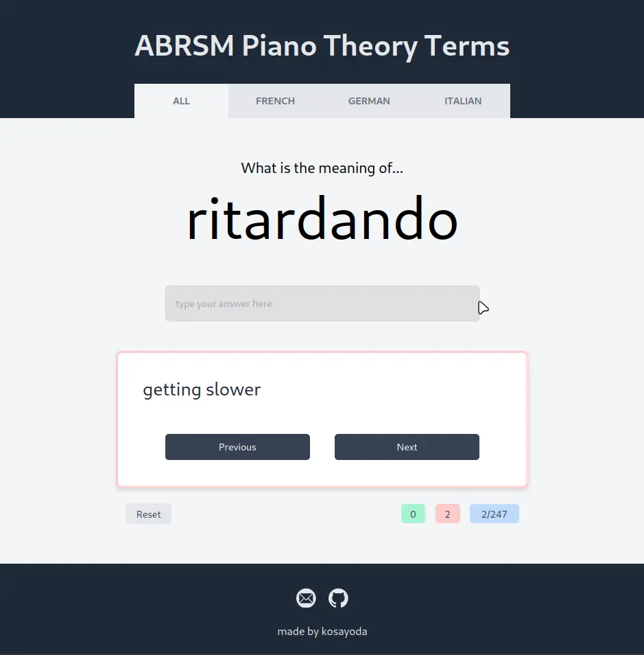

# ABRSM Theory Terms Quiz

A quiz for the ABRSM Grade 8 Piano Theory terms.

<p align="center" >
    <br>
    <a href="https://abrsm-terms-quiz.vercel.app">The project is hosted here.</a>
</p>

## Notes

1. Please let me know if you find any issues with spelling or term meanings.
2. This project is made with [SvelteKit](https://kit.svelte.dev/) and [TailwindCSS](https://tailwindcss.com/).
3. This project is hosted on [Vercel](https://vercel.com) on their free tier.
4. Feel free to open an issue if you have any suggestions!

## Running

```bash
# Install development dependencies
$ npm i -D

# Build the static website
$ npm run build
```

The resulting build will be in the `build/` folder. Serve with a static host of your choice.

## Developing

```bash
# Install development dependencies
$ npm i -D

# Start the development server
$ npm run dev -- --open
```
